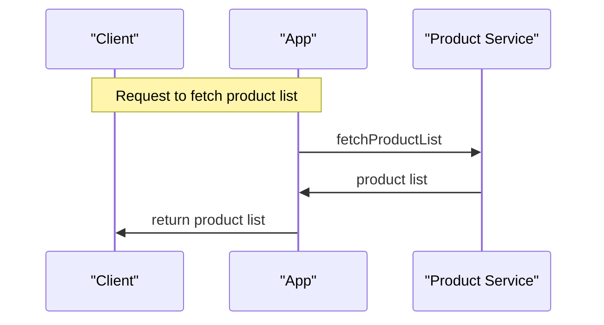

# architecture — architecture
Standing architecture document · last auto-updated by PR #1

## 1. Introduction & goals
Purpose and primary quality goals.

## 2. System context
External actors/systems table (system | relationship). Seeded once; only revise if the diff clearly adds a new external dependency — otherwise keep Existing.

## 3. Building blocks
`auto — updated by PR #1`
Internal components: optional mermaid flowchart (Client → Controllers → Services → Stores) grounded to the diff,
plus a table (component | responsibility).
Marked components:
- `AppComponent`: Updated UI title responsibility

## 4. Runtime view
`auto — updated by PR #1`
Key request flow as prose and/or mermaid sequenceDiagram. Regenerated only the flow changed:

## 5. Key decisions
`auto — entry added by PR #1`
Table: decision | rationale | source (PR #1).
- Update UI title to "Universal Product App" to reflect application branding.