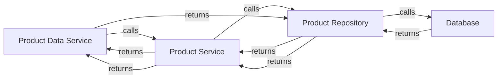

# architecture — architecture
Standing architecture document · last auto-updated by PR #1

## 1. Introduction & goals
 

## 2. System context
| system | relationship |
|--------|--------------|

## 3. Building blocks

| component | responsibility |
| --- | --- |
| ProductDataService | handles data retrieval and caching for product service |
| ProductService | provides data access to product repository |
| ProductRepository | abstracts database interactions for product service |
| Database | stores product data |

## 4. Runtime view
The request for product information is now handled by ProductDataService, which calls ProductService to retrieve product data from ProductRepository. The response from ProductRepository is then passed to ProductDataService.

## 5. Key decisions
| decision | rationale | source |
| --- | --- | --- |
| Using ProductDataService for data retrieval and caching | Improves performance and reduces latency | PR #1 |

## 6. Risks & technical debt
| risk | status |
| --- | --- |
| | |