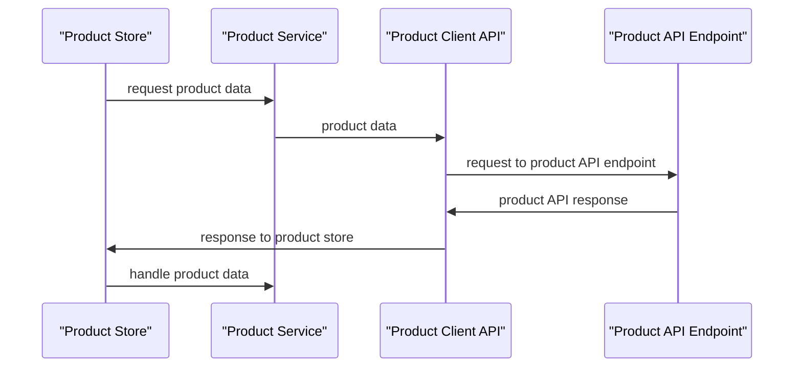

# Universal Product Store — architecture

## 1. Introduction & goals
 

## 2. System context

| system | relationship |
|--------|--------------|
| existing | existing |
| new     | new |

## 3. Building blocks
```mermaid
flowchart LR
    Service A -->|service| ProductStore
    ProductStore -->|product| ProductService
    ProductStore -->|api| ProductApiClient
    ProductApiClient -->|http| ProductApiEndpoint
```

| component | responsibility |
|------------|----------------|
| ProductStore | responsible for product service integration |
| ProductService | provides product data |
| ProductApiClient | handles product API requests |
| ProductApiEndpoint | exposes product API endpoints |

## 4. Runtime view

The request for the product is handled by the `ProductApiClient`, which makes a request to the `ProductApiEndpoint`. The `ProductStore` is responsible for integrating with the `ProductService` to retrieve product data.




## 5. Key decisions

| decision | rationale | source |
|----------|-----------|--------|
| new API endpoint | added to handle product API requests | PR #1 |

## 6. Risks & technical debt