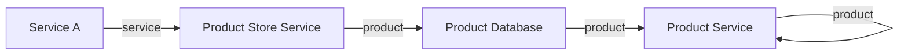
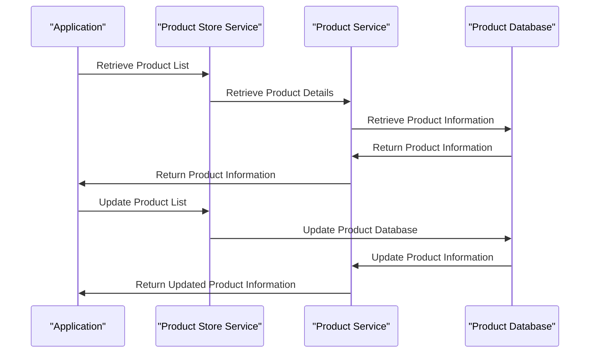

# Universal Product Store — architecture
Standing architecture document · last auto-updated by PR #1

## 1. Introduction & goals
No introduction or goals were present in the Existing file.

## 2. System context
| system | relationship |
|--------|--------------|
|(team to fill) |  |

## 3. Building blocks

| component | responsibility |
|------------|-----------------|
| ServiceA    | -               |
| productStore| -               |
| product     | -               |
| database    | -               |
| productService| -               |
| productService| -               |

## 4. Runtime view
The request/data flow changed by this PR involves a change in the title of the application. The new title is now 'Universal Product App'.

## 5. Key decisions
| decision | rationale | source |
|----------|-----------|--------|
|(team to fill) |  |  |

## 6. Risks & technical debt
| risk | status |
|-------|--------|
|(team to fill) |  |