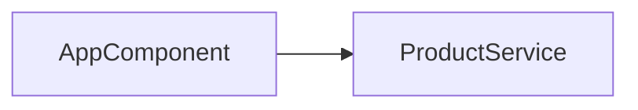

# Universal Product Store — architecture
Standing architecture document · last auto-updated by PR #1

## 1. Introduction & goals
`manual`
No manual section.

## 2. System context
`manual`
No manual section.

## 3. Building blocks
`auto — updated by PR #1`

| component | responsibility |
|-----------|----------------|
| AppComponent | Updates the application title shown in the UI |
| ProductService | Loads product data used by the UI |

## 4. Runtime view
`auto — updated by PR #1`
AppComponent reads state and renders the updated title; ProductService supplies product data when requested.

## 5. Key decisions
`auto — entry added by PR #1`
| decision | rationale | source |
|----------|-----------|--------|
| Change displayed title to Universal Product App | Matches product rename in AppComponent | PR #1 |

## 6. Risks & technical debt
No manual section.

---
