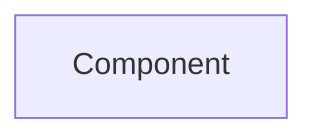

# Universal Product Store — architecture
Standing architecture document · last auto-updated by PR #1

## 1. Introduction & goals
`manual`
## 2. System context
`manual`
| system | relationship |
|--------|--------------|
| AppComponent | updates application title |

## 3. Building blocks
`auto — updated by PR #1`

mermaid
flowchart LR
```
  AppComponent[AppComponent] --> ProductService[ProductService]
```

| component | responsibility |
|-----------|----------------|
| AppComponent | Updates application title |

## 4. Runtime view
`auto — updated by PR #1`
AppComponent reads state and renders updated title; ProductService supplies product data when requested.

## 5. Key decisions
`auto — entry added by PR #1`
| decision | rationale | source |
|----------|-----------|--------|
| Change displayed title to Universal Product App | Matches product rename in AppComponent | PR #1 |
