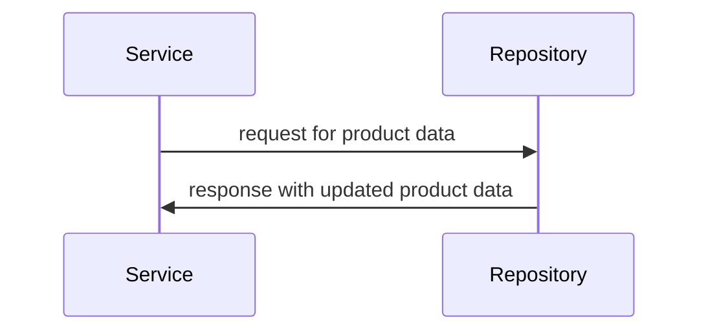

# Universal Product Store — architecture

## 1. Introduction & goals

No introduction yet.

## 2. System context

| system | relationship |
|--------|--------------|
| ProductService | used by |
| ProductStore | used by |

## 3. Building blocks
```mermaid
flowchart LR
    ProductStore["ProductStore"] -->|request| ProductService["ProductService"]
    ProductService["ProductService"] -->|response| ProductStore["ProductStore"]
    classProductStore["class ProductStore"] "Repository" asserviceA["as serviceA"]
    classProductService["class ProductService"] "Service" asserviceB["as serviceB"]
    ProductStore["Repository"] -->|update| ProductService["Service"]
    ProductService["Service"] -->|call| ProductStore["Repository"]
```


| component | responsibility |
|-----------|-----------------|
| ProductService | handles product data |
| ProductStore | manages product data |

## 4. Runtime view

The `ProductService` is now responsible for updating the `ProductStore` repository.




## 5. Key decisions

| decision | rationale | source |
|----------|-----------|--------|
| Update ProductService to handle product data | Simplify data flow | pull-1.diff |

## 6. Risks & technical debt

| risk | status |
|------|-------|
|  |  |