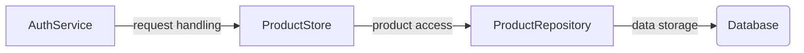

# Universal Product Store — architecture

Standing architecture document · last auto-updated by PR #1

## 1. Introduction & goals
No content available.

## 2. System context
| system | relationship |
|--------|--------------|
| (team to fill) |  |

## 3. Building blocks

| component | responsibility (real names from the diff; note "added PR #1" only for new ones) |
| --- | --- |
| AuthService | request handling |
| ProductStore | product access |
| ProductRepository | data storage |

## 4. Runtime view
The Universal Product Store now uses a new request handling mechanism, replacing the previous component. This change allows for improved error handling and better integration with the product service.

```mermaid sequenceDiagram
    participant AuthService as API Gateway
    participant ProductStore as Product Service
    participant ProductService as Product Repository
    note right of AuthService: request handling
    note left of ProductService: product data access
    ProductStore->>ProductService: product access request
    ProductService->>ProductRepository: product data access request
    ProductRepository->>Database: product data storage
    note right of ProductRepository: data storage
```

## 5. Key decisions
| decision | rationale | source |
| --- | --- | --- |
| (team to fill) |  |  |

## 6. Risks & technical debt
| risk | status |
| --- | --- |
| (team to fill) |  |